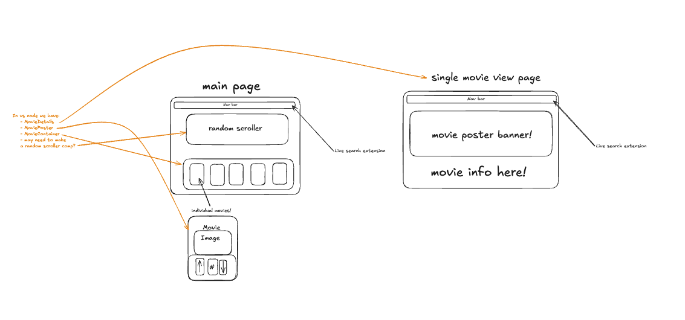
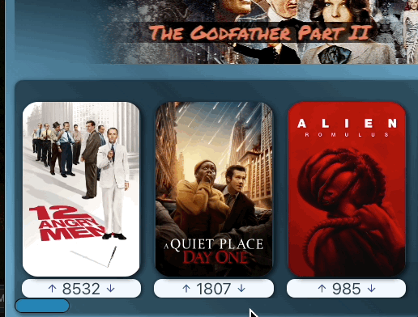

# Rancid Tomatillos 

Rancid Tomatillos is a movie review app that allows users to browse a curated list of films and engage with them through upvotes, downvotes, and seeing movie details. It provides an easy-to-use interface for exploring movie details, posters, and user-generated votes, ensuring a dynamic and interactive experience.

### Context

This project was a collaborative effort completed within the time frame of 10 days. Both of us actively contributed to every aspect, ensuring a well-rounded and cohesive final product.

### Tech

Built with React and tested with Cypress

### Installation

1.  Fork and clone this repo
4.  `cd` into the directory
5.  Install necessary dependencies with `npm install`
6.  Run your React app with `npm start`
7.  Go to `http://localhost:3000/` and you should see a page with some starter elements
8.  Enter `control + c` in your terminal to stop running the React app at any time
9. To run Cypress tests, use `npx cypress open`

## Usage
This GIF demonstrates the page load process, highlighting the random movie scroller and the movie container, which features a selection of films.

 
This GIF showcases the up and down votes functionality and button micro-animations.
  

 
This GIF showcases selecting a movie with a click, viewing the movie details page, and returning home.

 

 
This GIF highlights how movies and their votes are fully tabbable, allowing users to navigate, select, and ‘click’ on them by pressing the Enter key.
 

 
This GIF highlights the scroller action within the movies container.

### Contributors:

Charles Banks - [linkedin](https://www.linkedin.com/in/charles-t-banks-jr-6b982b152/) - [gitHub](https://github.com/DRIF7ER) - charlesbanks238@gmail.com

Jim Macur - [linkedin](https://www.linkedin.com/in/jimmacur/) - [gitHub](https://github.com/jimmacur) - jim.macur@gmail.com 

Project Link: [Rancid Tomatillos gitHub Repo](https://github.com/jimmacur/rancid-tomatillos)

### Learning Goals

- Gain competency with React fundamentals
- Make several network requests and handle asynchronous JS
- Test React application with Cypress
- Create a multi-page application using Router
- Practice refactoring